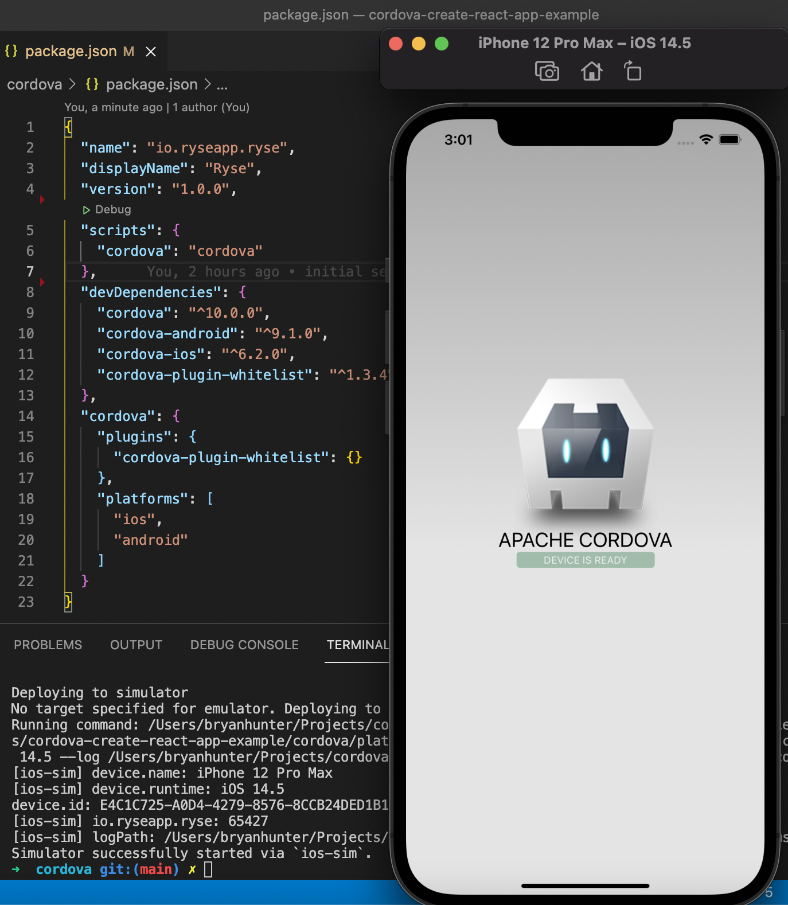
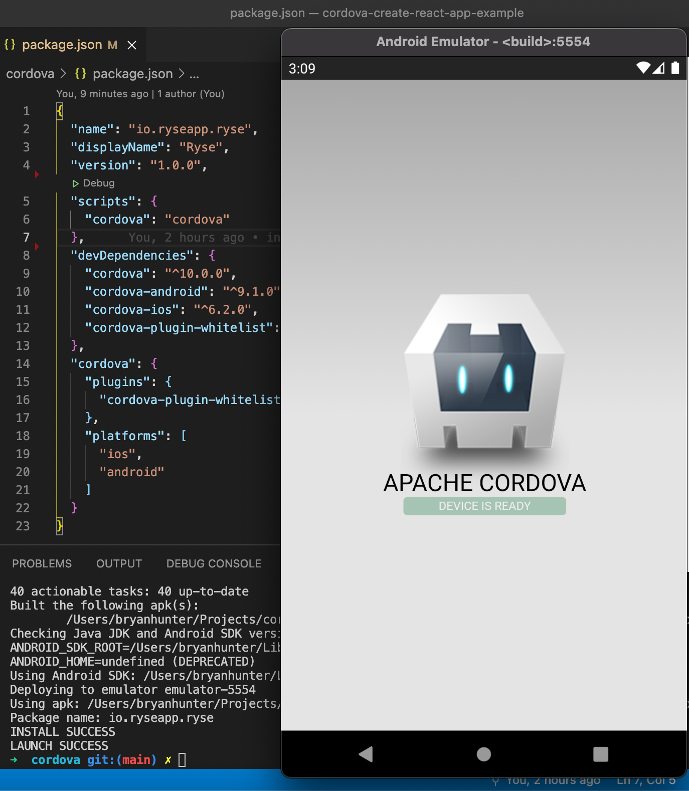
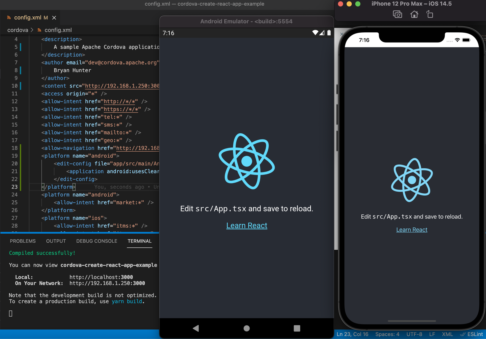
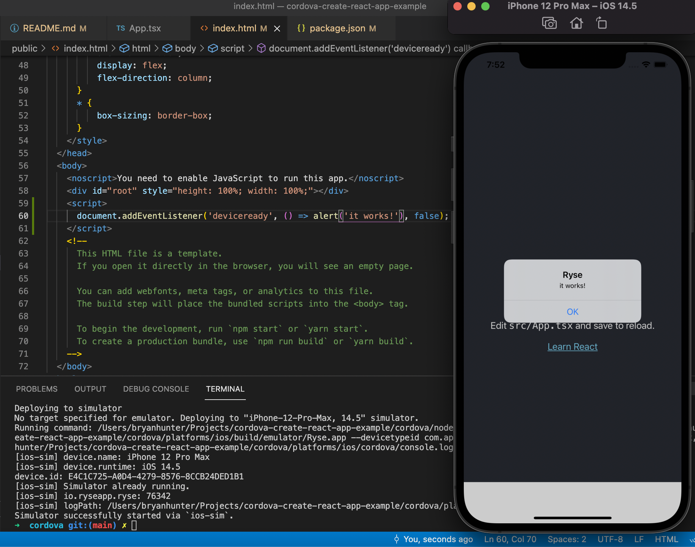
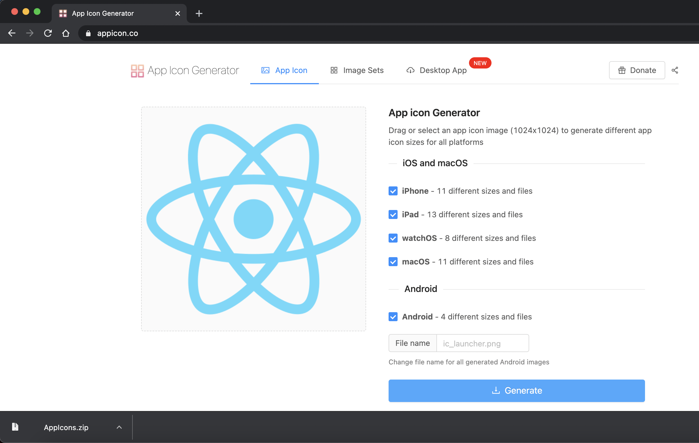
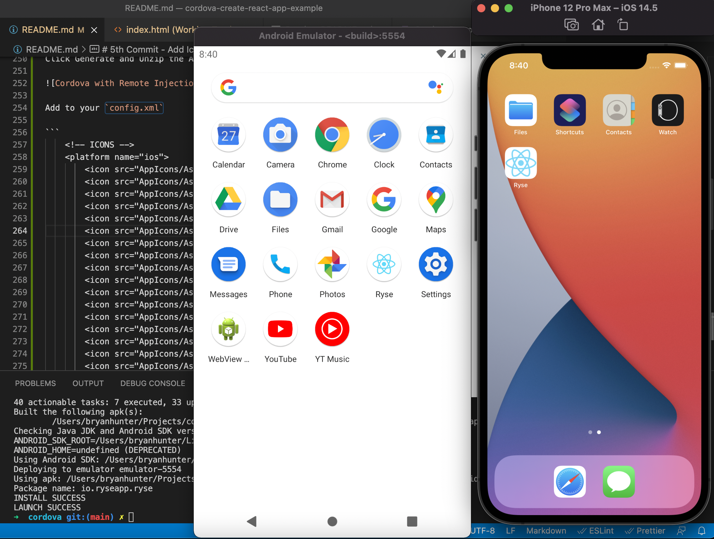
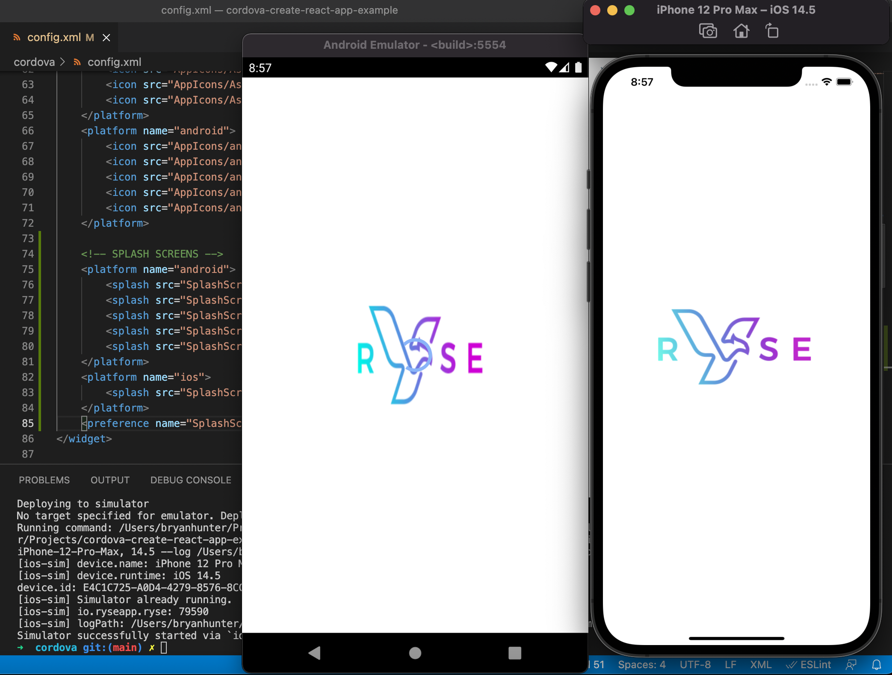

# Step by step guide to wrapping Create React App with Cordova

### Requirements

 - Deploy React app as a hosted web app separate from the native Cordova app
 - Build native Cordova app shell for Android and iOS that loads the hosted web app
 - Push notifications for iOS and Android
 - Inject Cordova javascript into web app so it can interact with native Cordova app

### Cordova Plugins Used

 - cordova-plugin-whitelist (so our native Cordova app can only load URLs specified)
 - @havesource/cordova-plugin-push (Cordova push notification support for iOS and Android)
 - cordova-plugin-remote-injection (inject Cordova javascript into Hosted remote app to access native functionality)

# 1st Commit - Initial CRA and Cordova Setup

Create React App

```
npx create-react-app cordova-create-react-app-example --template typescript

cd cordova-create-react-app-example
```

Cordova Create

```
npx cordova create cordova io.ryseapp.ryse Ryse
```

notes: "Ryse" is YOUR app name "io.ryseapp.ryse" is typically YOUR domain reversed with the app name appended

# 2nd Commit - Setup Cordova to be able to run on iOS and Android Emulators

```
cd cordova
npm install cordova -D // so that your teammates won't need to have it installed globally
```

Add to `scripts` in cordova `package.json`

```
  "scripts": {
    "cordova": "cordova"
  },
```

Add iOS and Android platforms - this generates code in "cordova/platforms" that you should not modify

```
npm run cordova platform add ios
npm run cordova platform add android
```

## Prerequisites for building Cordova app

### iOS

Following steps from https://cordova.apache.org/docs/en/10.x/guide/platforms/ios/index.html

Download `XCode` from App Store

```
xcode-select --install
brew install ios-deploy
sudo gem install cocoapods
```

#### On new macs with M1 chip run:

```
sudo arch -x86_64 gem install ffi
```

### Android

Following steps from: https://cordova.apache.org/docs/en/10.x/guide/platforms/android/index.html

Download `Android Studio` and run through setup wizard

Add `JAVA_HOME` and `ANDROID_SDK_ROOT` environment variables to your PATH

example for ~/.zshrc

```
export ANDROID_SDK_ROOT=/Users/bryanhunter/Library/Android/sdk
export PATH=\${PATH}:/Users/bryanhunter/Library/Android/sdk/tools:/Users/bryanhunter/Library/Android/sdk/tools/bin:/Users/bryanhunter/Library/Android/sdk/platform-tools

// find Java SDK with

/usr/libexec/java_home -V | grep jdk

// should look like /Library/Java/JavaVirtualMachines/jdk1.8.0_281.jdk/Contents/Home

export JAVA_HOME=/Library/Java/JavaVirtualMachines/jdk1.8.0_281.jdk/Contents/Home
export PATH=$JAVA_HOME/bin:$PATH

source ~/.zshrc
```

#### Android Emulator for new macs with M1 chip

Have at least Android SDK version 4.1.3.

To install from Android Studio:

Tools -> AVD Manager -> Create Virtual Device -> Pixel4 (with Google Play symbol) -> Next -> Select System Image / Other Images / Release S with ABI arm64-v8a

note: may have to start Emulator twice for it to work.


## Verify "cordova run" works for iOS and Android

### iOS

```
npm run cordova run ios
```



### Android

Start your Android Emulator first

```
npm run cordova run android
```



# 3rd Commit - Run React app and load inside of Cordova

## Modify config.xml with the following

```
<widget id="io.ryseapp.ryse" version="1.0.0" xmlns="http://www.w3.org/ns/widgets" xmlns:cdv="http://cordova.apache.org/ns/1.0" xmlns:android="http://schemas.android.com/apk/res/android">

    <content src="http://localhost:3000" />
    <allow-navigation href="http://localhost:3000/*" />
    <platform name="android">
        <edit-config file="app/src/main/AndroidManifest.xml" mode="merge" target="/manifest/application">
            <application android:usesCleartextTraffic="true" />
        </edit-config>
    </platform>

```

Note: we can remove everything under the `www` folder, because we're loading a hosted app and not a bundled one.  However, Cordova still requires a `www` folder to exist to run, so I just create a file named `_cordova-requires-www-folder-to-start` to avoid confusion.

## Start the React app and run Cordova on iOS and Android

Start React app in terminal

navigate to app root directory

```
yarn start
```

Run Cordova on iOS and Android in another terminal

```
cd cordova
npm run cordova run ios
npm run cordova run android
```



## Modify React app public/index.html so that it looks and feels native instead of in a nested browser

```
  ...

    <meta name="viewport" content="initial-scale=1, maximum-scale=1.0, height=device-height, width=device-width, viewport-fit=cover, user-scalable=no">

  ...

    <style>
      html {
          border: 0;
          margin: 0;
          padding:0px;
          width: 100%;
          /* has to be vh and not % for IOS to fill entire phone screen */
          height: 100vh;
          overflow: hidden;
      }
      body {
          border: 0;
          margin: 0;
          padding:0px;
          /* Padding to avoid the "unsafe" areas behind notches in the screen */
          padding: env(safe-area-inset-top, 0px) env(safe-area-inset-right, 0px) env(safe-area-inset-bottom, 0px) env(safe-area-inset-left, 0px);
          position: fixed;
          width: 100%;
          height: 100%;
          overflow: hidden;
          display: flex;
          flex-direction: column;
      }
      * {
          box-sizing: border-box;
      }
    </style>

  ...

    <div id="root" style="height: 100%; width: 100%;"></div>
```

# 4th Commit - Add cordova-plugin-remote-injection and verify access on React app

Temporarily add this to your React public/index.html

```
    <script>
      document.addEventListener('deviceready', () => alert('it works!'), false);
    </script>
```

You can verify that this "alert" does not display before you add the plugin.

Add the cordova-plugin-remote-injection plugin to your Cordova app

```
npm run cordova plugin add cordova-plugin-remote-injection
```

Start React app and run Cordova to verify access to injected Cordova javascript on React app

```
yarn start

...

npm run cordova run ios
```



Remove the `<script></script>` from public/index.html because we were just using that to test.

# 5th Commit - Add Icons for iOS and Android

Use https://appicon.co/ to Upload your icon (public/logo512.png for default Create React App)

Click Generate and Unzip the AppIcons folder and move it under /cordova



Add to your `config.xml`

```
    <!-- ICONS -->
    <platform name="ios">
        <icon src="AppIcons/Assets.xcassets/AppIcon.appiconset/16.png" width="16" height="16" />
        <icon src="AppIcons/Assets.xcassets/AppIcon.appiconset/20.png" width="20" height="20" />
        <icon src="AppIcons/Assets.xcassets/AppIcon.appiconset/29.png" width="29" height="29" />
        <icon src="AppIcons/Assets.xcassets/AppIcon.appiconset/32.png" width="32" height="32" />
        <icon src="AppIcons/Assets.xcassets/AppIcon.appiconset/40.png" width="40" height="40" />
        <icon src="AppIcons/Assets.xcassets/AppIcon.appiconset/48.png" width="48" height="48" />
        <icon src="AppIcons/Assets.xcassets/AppIcon.appiconset/50.png" width="50" height="50" />
        <icon src="AppIcons/Assets.xcassets/AppIcon.appiconset/55.png" width="55" height="55" />
        <icon src="AppIcons/Assets.xcassets/AppIcon.appiconset/57.png" width="57" height="57" />
        <icon src="AppIcons/Assets.xcassets/AppIcon.appiconset/58.png" width="58" height="58" />
        <icon src="AppIcons/Assets.xcassets/AppIcon.appiconset/60.png" width="60" height="60" />
        <icon src="AppIcons/Assets.xcassets/AppIcon.appiconset/64.png" width="64" height="64" />
        <icon src="AppIcons/Assets.xcassets/AppIcon.appiconset/72.png" width="72" height="72" />
        <icon src="AppIcons/Assets.xcassets/AppIcon.appiconset/76.png" width="76" height="76" />
        <icon src="AppIcons/Assets.xcassets/AppIcon.appiconset/80.png" width="80" height="80" />
        <icon src="AppIcons/Assets.xcassets/AppIcon.appiconset/87.png" width="87" height="87" />
        <icon src="AppIcons/Assets.xcassets/AppIcon.appiconset/88.png" width="88" height="88" />
        <icon src="AppIcons/Assets.xcassets/AppIcon.appiconset/100.png" width="100" height="100" />
        <icon src="AppIcons/Assets.xcassets/AppIcon.appiconset/114.png" width="114" height="114" />
        <icon src="AppIcons/Assets.xcassets/AppIcon.appiconset/120.png" width="120" height="120" />
        <icon src="AppIcons/Assets.xcassets/AppIcon.appiconset/128.png" width="128" height="128" />
        <icon src="AppIcons/Assets.xcassets/AppIcon.appiconset/144.png" width="144" height="144" />
        <icon src="AppIcons/Assets.xcassets/AppIcon.appiconset/152.png" width="152" height="152" />
        <icon src="AppIcons/Assets.xcassets/AppIcon.appiconset/167.png" width="167" height="167" />
        <icon src="AppIcons/Assets.xcassets/AppIcon.appiconset/172.png" width="172" height="172" />
        <icon src="AppIcons/Assets.xcassets/AppIcon.appiconset/180.png" width="180" height="180" />
        <icon src="AppIcons/Assets.xcassets/AppIcon.appiconset/196.png" width="196" height="196" />
        <icon src="AppIcons/Assets.xcassets/AppIcon.appiconset/216.png" width="216" height="216" />
        <icon src="AppIcons/Assets.xcassets/AppIcon.appiconset/256.png" width="256" height="256" />
        <icon src="AppIcons/Assets.xcassets/AppIcon.appiconset/512.png" width="512" height="512" />
        <icon src="AppIcons/Assets.xcassets/AppIcon.appiconset/1024.png" width="1024" height="1024" />
    </platform>
    <platform name="android">
        <icon src="AppIcons/android/mipmap-mdpi/ic_launcher.png" density="mdpi" />
        <icon src="AppIcons/android/mipmap-hdpi/ic_launcher.png" density="hdpi" />
        <icon src="AppIcons/android/mipmap-xhdpi/ic_launcher.png" density="xhdpi" />
        <icon src="AppIcons/android/mipmap-xxhdpi/ic_launcher.png" density="xxhdpi" />
        <icon src="AppIcons/android/mipmap-xxxhdpi/ic_launcher.png" density="xxxhdpi" />
    </platform>
```

Verify the Icons on Android and iOS



# 6th Commit - Add Splash Screens

```
npm run cordova plugin add cordova-plugin-splashscreen
```

For both Android and iOS, you typically want your Splash Screen image to be centered and the main contents of the image to not be anywhere near the edges so that it doesn't accidentally get clipped.

For Android, you need PNGs of size:

- 300x300 - mdpi
- 450x450 - hdpi
- 600x600 - xhdpi
- 900x900 - xxhdpi
- 1200x1200 - xxxhdpi

For iOS, you can use a single universal image of size:

- 2732x2732 - universal

You can set the SplashScreen delay, we chose 3 seconds to give the React app a little bit of time to load before displaying it.

Add to your `config.xml`

```
    <!-- SPLASH SCREENS -->
    <platform name="android">
        <splash src="SplashScreens/android/port-hdpi.png" density="hdpi"/>
        <splash src="SplashScreens/android/port-mdpi.png" density="mdpi"/>
        <splash src="SplashScreens/android/port-xhdpi.png" density="xhdpi"/>
        <splash src="SplashScreens/android/port-xxhdpi.png" density="xxhdpi"/>
        <splash src="SplashScreens/android/port-xxxhdpi.png" density="xxxhdpi"/>
    </platform>
    <platform name="ios">
        <splash src="SplashScreens/ios/Default@2x~universal~anyany.png" />
    </platform>
    <preference name="SplashScreenDelay" value="3000" />
```

Verify the SplashScreens on Android and iOS



# 7th Commit - Add permissions, preferences, and patch cordova-ios and cordova-plugin-remote-injection to allow upload to App Store

One risk with using Cordova is that the App Store or Play Store can suddenly refuse your app for certain security or deprecation reasons

Because of this, we had to use [patch-package](https://github.com/ds300/patch-package) library to add and remove some code from cordova-ios and cordova-plugin-remote-injection libraries.  Some of these libraries are no longer maintained or don't fit our exact use case, so we had to patch them ourselves.

## Install patch-package

First install [patch-package](https://github.com/ds300/patch-package) in our `cordova` folder

```
npm install patch-package -D
```

add `postinstall` to `scripts` in cordova/package.json

```
  "scripts": {
    "cordova": "cordova",
    "postinstall": "patch-package"
  },
```

## Patch cordova-ios to include limitsNavigationsToAppBoundDomains

Patch the `cordova-ios` (6.2.0) package to include the `limitsNavigationsToAppBoundDomains` setting

Normally, we would modify the `cordova-ios` package in `node_modules` and then run patch-package to generate a patch file for us, but I have already done this and this is the generated patch file:

Make a `patches` directory under `cordova` and add `cordova-ios+6.2.0.patch` file under there

cordova-ios+6.2.0.patch

```
diff --git a/node_modules/cordova-ios/CordovaLib/Classes/Private/Plugins/CDVWebViewEngine/CDVWebViewEngine.m b/node_modules/cordova-ios/CordovaLib/Classes/Private/Plugins/CDVWebViewEngine/CDVWebViewEngine.m
index a07bf29..5a378ea 100644
--- a/node_modules/cordova-ios/CordovaLib/Classes/Private/Plugins/CDVWebViewEngine/CDVWebViewEngine.m
+++ b/node_modules/cordova-ios/CordovaLib/Classes/Private/Plugins/CDVWebViewEngine/CDVWebViewEngine.m
@@ -73,6 +73,7 @@
 {
     WKWebViewConfiguration* configuration = [[WKWebViewConfiguration alloc] init];
     configuration.processPool = [[CDVWebViewProcessPoolFactory sharedFactory] sharedProcessPool];
+    configuration.limitsNavigationsToAppBoundDomains = [settings cordovaBoolSettingForKey:@"LimitsNavigationsToAppBoundDomains" defaultValue:NO];
     if (settings == nil) {
         return configuration;
     }

```

## Patch cordova-plugin-remote-injection to remove deprecated UIWebView references

Under `cordova/patches` directory add `cordova-plugin-remote-injection+0.5.2.patch` file under there

cordova-plugin-remote-injection+0.5.2

```
diff --git a/node_modules/cordova-plugin-remote-injection/plugin.xml b/node_modules/cordova-plugin-remote-injection/plugin.xml
index 9c79964..7164046 100644
--- a/node_modules/cordova-plugin-remote-injection/plugin.xml
+++ b/node_modules/cordova-plugin-remote-injection/plugin.xml
@@ -18,8 +18,6 @@
     <source-file src="src/ios/CDVRemoteInjection.m" />
     <header-file src="src/ios/CDVRemoteInjectionWebViewBaseDelegate.h" />
     <source-file src="src/ios/CDVRemoteInjectionWebViewBaseDelegate.m" />
-    <header-file src="src/ios/CDVRemoteInjectionUIWebViewDelegate.h" />
-    <source-file src="src/ios/CDVRemoteInjectionUIWebViewDelegate.m" />
     <header-file src="src/ios/CDVRemoteInjectionWKWebViewDelegate.h" />
     <source-file src="src/ios/CDVRemoteInjectionWKWebViewDelegate.m" />
   </platform>
diff --git a/node_modules/cordova-plugin-remote-injection/src/ios/CDVRemoteInjection.m b/node_modules/cordova-plugin-remote-injection/src/ios/CDVRemoteInjection.m
index 9c11eb9..e152d3b 100644
--- a/node_modules/cordova-plugin-remote-injection/src/ios/CDVRemoteInjection.m
+++ b/node_modules/cordova-plugin-remote-injection/src/ios/CDVRemoteInjection.m
@@ -6,7 +6,6 @@
 #import <WebKit/WebKit.h>
 
 #import "CDVRemoteInjection.h"
-#import "CDVRemoteInjectionUIWebViewDelegate.h"
 #import "CDVRemoteInjectionWKWebViewDelegate.h"
 
 @implementation CDVRemoteInjectionPlugin {
@@ -81,13 +80,7 @@
     }
 
     id webView = [self findWebView];
-    if ([webView isKindOfClass:[UIWebView class]]) {
-        NSLog(@"Found UIWebView");
-        webViewDelegate = [[CDVRemoteInjectionUIWebViewDelegate alloc] init];
-        [webViewDelegate initializeDelegate:self];
-        
-        return;
-    } else if ([webView isKindOfClass:[WKWebView class]]) {
+    if ([webView isKindOfClass:[WKWebView class]]) {
         NSLog(@"Found WKWebView");
         webViewDelegate = [[CDVRemoteInjectionWKWebViewDelegate alloc] init];
         [webViewDelegate initializeDelegate:self];
diff --git a/node_modules/cordova-plugin-remote-injection/src/ios/CDVRemoteInjectionUIWebViewDelegate.h b/node_modules/cordova-plugin-remote-injection/src/ios/CDVRemoteInjectionUIWebViewDelegate.h
deleted file mode 100644
index b451824..0000000
--- a/node_modules/cordova-plugin-remote-injection/src/ios/CDVRemoteInjectionUIWebViewDelegate.h
+++ /dev/null
@@ -1,13 +0,0 @@
-#import "CDVRemoteInjection.h"
-#import "CDVRemoteInjectionWebViewBaseDelegate.h"
-
-@interface CDVRemoteInjectionUIWebViewDelegate: CDVRemoteInjectionWebViewBaseDelegate <CDVRemoteInjectionWebViewDelegate>
-@property (readwrite, weak) CDVRemoteInjectionPlugin *plugin;
-- (void) onWebViewDidStartLoad;
-- (void) onWebViewDidFinishLoad:(UIWebView *)webView;
-- (void) onWebViewFailLoadWithError:(NSError *)error;
-@end
-
-@interface CDVRemoteInjectionUIWebViewNotificationDelegate : WrappedDelegateProxy <UIWebViewDelegate>
-@property (readwrite, weak) CDVRemoteInjectionUIWebViewDelegate *webViewDelegate;
-@end
diff --git a/node_modules/cordova-plugin-remote-injection/src/ios/CDVRemoteInjectionUIWebViewDelegate.m b/node_modules/cordova-plugin-remote-injection/src/ios/CDVRemoteInjectionUIWebViewDelegate.m
deleted file mode 100644
index bb0251e..0000000
--- a/node_modules/cordova-plugin-remote-injection/src/ios/CDVRemoteInjectionUIWebViewDelegate.m
+++ /dev/null
@@ -1,100 +0,0 @@
-//
-//  CDVRemoteInjection.m
-//
-
-#import <Foundation/Foundation.h>
-
-#import "CDVRemoteInjectionUIWebViewDelegate.h"
-#import "CDVRemoteInjectionWebViewBaseDelegate.h"
-
-
-@implementation CDVRemoteInjectionUIWebViewNotificationDelegate
-@dynamic wrappedDelegate;
-
-- (void)webViewDidStartLoad:(UIWebView*)webView
-{
-    [self.webViewDelegate onWebViewDidStartLoad];
-    
-    if ([self.wrappedDelegate respondsToSelector:@selector(webViewDidStartLoad:)]) {
-        [self.wrappedDelegate webViewDidStartLoad:webView];
-    }
-}
-
-- (void)webViewDidFinishLoad:(UIWebView *)webView
-{
-    [self.webViewDelegate onWebViewDidFinishLoad:webView];
-    
-    if ([self.wrappedDelegate respondsToSelector:@selector(webViewDidFinishLoad:)]) {
-        [self.wrappedDelegate webViewDidFinishLoad:webView];
-    }
-}
-
-- (void)webView:(UIWebView *)webView didFailLoadWithError:(NSError *)error
-{
-    if ([self.wrappedDelegate respondsToSelector:@selector(webView:didFailLoadWithError:)]) {
-        [self.wrappedDelegate webView:webView didFailLoadWithError:error];
-    }
-    
-    [self.webViewDelegate onWebViewFailLoadWithError:error];
-}
-@end
-
-@implementation CDVRemoteInjectionUIWebViewDelegate
-{
-    CDVRemoteInjectionUIWebViewNotificationDelegate *notificationDelegate;
-}
-
-- (void)initializeDelegate:(CDVRemoteInjectionPlugin *)plugin
-{
-    self.plugin = plugin;
-
-    // Wrap the current delegate with our own so we can hook into web view events.
-    UIWebView *uiWebView = [plugin findWebView];
-    notificationDelegate = [[CDVRemoteInjectionUIWebViewNotificationDelegate alloc] init];
-    notificationDelegate.wrappedDelegate = [uiWebView delegate];
-    notificationDelegate.webViewDelegate = self;
-    [uiWebView setDelegate:notificationDelegate];
-}
-
--(void) onWebViewDidStartLoad
-{
-    [super webViewRequestStart];
-}
-
-/*
- * After page load inject cordova and its plugins.
- */
-- (void) onWebViewDidFinishLoad:(UIWebView *)webView
-{
-    // Cancel the slow request timer.
-    [self cancelRequestTimer];
- 
-    // Inject cordova into the page.
-    NSString *scheme = webView.request.URL.scheme;
- 
-    if ([self isSupportedURLScheme:scheme]){
-        [webView stringByEvaluatingJavaScriptFromString:[self buildInjectionJS]];
-    }
-}
-
-// Handles notifications from the webview delegate whenever a page load fails.
-- (void) onWebViewFailLoadWithError:(NSError *)error
-{
-    [self loadPageFailure:error];
-}
-
-- (BOOL) isLoading
-{
-    UIWebView *uiWebView = [self.plugin findWebView];
-    return uiWebView.loading;
-}
-
-- (void) retryCurrentRequest
-{
-    UIWebView *webView = [self.plugin findWebView];
-    
-    [webView stopLoading];
-    [webView reload];
-}
-
-@end
```

## Remove and re-add Android and iOS platforms after npm install

```
npm run cordova platform remove ios
npm run cordova platform remove android
```

Add cordova-ios and cordova-android to devDependencies before re-adding ios and android so that we can patch-package cordova-ios

```
  "devDependencies": {
    "cordova": "^10.0.0",
    "cordova-android": "^9.0.0",
    "cordova-ios": "^6.2.0",
    "cordova-plugin-remote-injection": "^0.5.2",
    "cordova-plugin-splashscreen": "^6.0.0",
    "cordova-plugin-whitelist": "^1.3.4",
    "patch-package": "^6.4.7"
  },
```

run npm install so that patch-package will be run before we add ios and android platforms

```
npm install
npm run cordova platform add ios
npm run cordova platform add android
```

## Update config.xml with preferences and permissions

Allow swipe and back buttons to navigate in mobile browser
Restrict which domains we can load in the mobile browser

```
    <preference name="AllowBackForwardNavigationGestures" value="true" />

    <!-- IOS App Bound Domains -->
    <platform name="ios">
        <config-file target="*-Info.plist" parent="WKAppBoundDomains">
            <array>
                <!-- <string>{YOUR_DOMAIN}</string> -->
                <!-- <string>auth.{YOUR_DOMAIN}</string> -->
                <string>http://192.168.1.250:3000</string>
            </array>
        </config-file>
        <preference name="LimitsNavigationsToAppBoundDomains" value="true" />
    </platform>

    <!-- Misc permissions you may want in your app -->
    <platform name="ios">
        <config-file target="*-Info.plist" parent="NSCameraUsageDescription">
            <string>need camera access to take pictures</string>
        </config-file>
        <config-file target="*-Info.plist" parent="NSPhotoLibraryUsageDescription">
            <string>need photo library access to get pictures from there</string>
        </config-file>
        <config-file target="*-Info.plist" parent="NSLocationWhenInUseUsageDescription">
            <string>need location access to find things nearby</string>
        </config-file>
        <config-file target="*-Info.plist" parent="NSPhotoLibraryAddUsageDescription">
            <string>need photo library access to save pictures there</string>
        </config-file>
    </platform>
```

## Update package.json scripts to make setup easy for other developers

Update our scripts so other developers can setup their local Cordova (platforms and plugins folders) more easily

```
    "scripts": {
        "cordova": "cordova",
        "postinstall": "patch-package",
        "run:android": "cordova run android -d",
        "run:ios": "cordova run ios --debug -d",
        "run:ios:release": "cordova run ios --release -d",
        "setup": "npm install && npm run setup:ios && npm run setup:android",
        "setup:android": "cordova platform add android",
        "setup:ios": "cordova platform add ios"
    },
```

We will commit our package.json and patch files, so other developers can just run

```
cd cordova
npm run setup
npm run run:android
npm run run:ios
```
